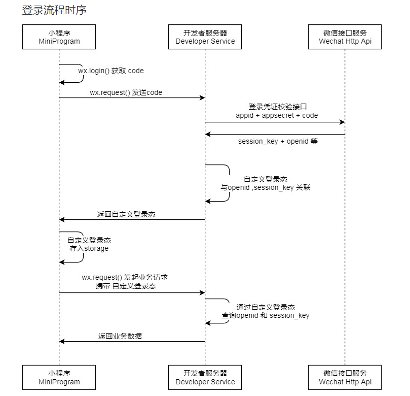

# API


## 用户相关

* 登陆 - `post`

  ```
  api/login
  ```

  `Request` -  `application/json`

  ```
  [
    code: string 登录时获取的code
  ]
  ```

  > 三方服务器向微信服务器获取**openid**和**session_key**

  `Response` 

  ```
  [
    token: string 聚宽的token
    openid：string 用户唯一标识
    isVip: bool 是否是VIP
    msg: string 报错信息
    stocks: [
      code string 股票代码,
      ......
    ] json 用户收藏的股票
  ]
  ```

  

  

* 获取自选股信息 - `get`

  ```
  api/stocks/{userid}
  ```

  `Response:`

  ```
  [
    userId: string userid
    stocks: [
      code string 股票代码,
      ......
    ]
    msg: string 报错信息
  ]
  ```

* 增加/删除自选股信息 - `post`

  ```
  增加：api/stocks/add
  删除：api/stocks/remove 
  ```
  
  `Request` -  `application/json` 
  
  ```
  [
    userId: string 用户唯一标识
    stockCode: string 股票代码
  ]
  ```
  `Response:`
  ```
  [
    userId: string 用户唯一标识
    stocks: [
      code string 股票代码,
      ......
    ]
    msg: string 报错信息
  ]
  ```
  
* Vip校验 - `post`

  ```
  api/user/vip
  ```

  `Request`  -  `application/json`

  ```
  [
    userId: string 用户唯一标识
    vipCode: string vip校验码
  ]
  ```

  `Response`

  ```
  [
    userId: string 用户唯一标识
    status: bool 是否成功认证
    msg: string 报错信息
  ]
  ```

## 资讯信息

* 分页获取咨询信息 - `get`
  ```
  api/news?from=[0-9]+&to=[0-9]+
  ```

* 信息来源：今日经济类新闻

* Resonse

  ```
  [
    from: int 起始 
    to:   int 结束
    msg:  string 报错信息
    data：[
      [
        title: string
        time: string
        detail: string
      ],
      ...
    ]
  ]
  ```
  
  


